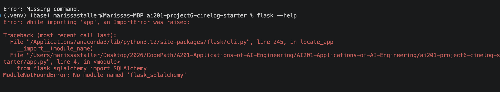
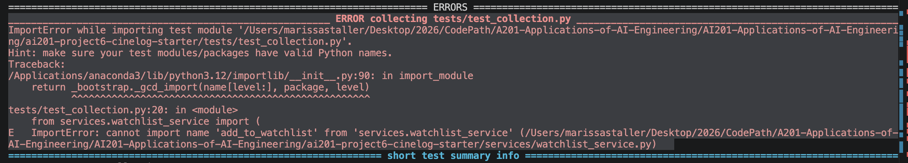
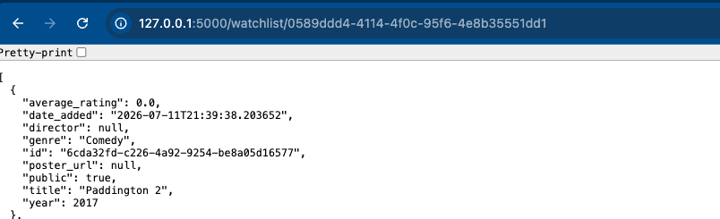
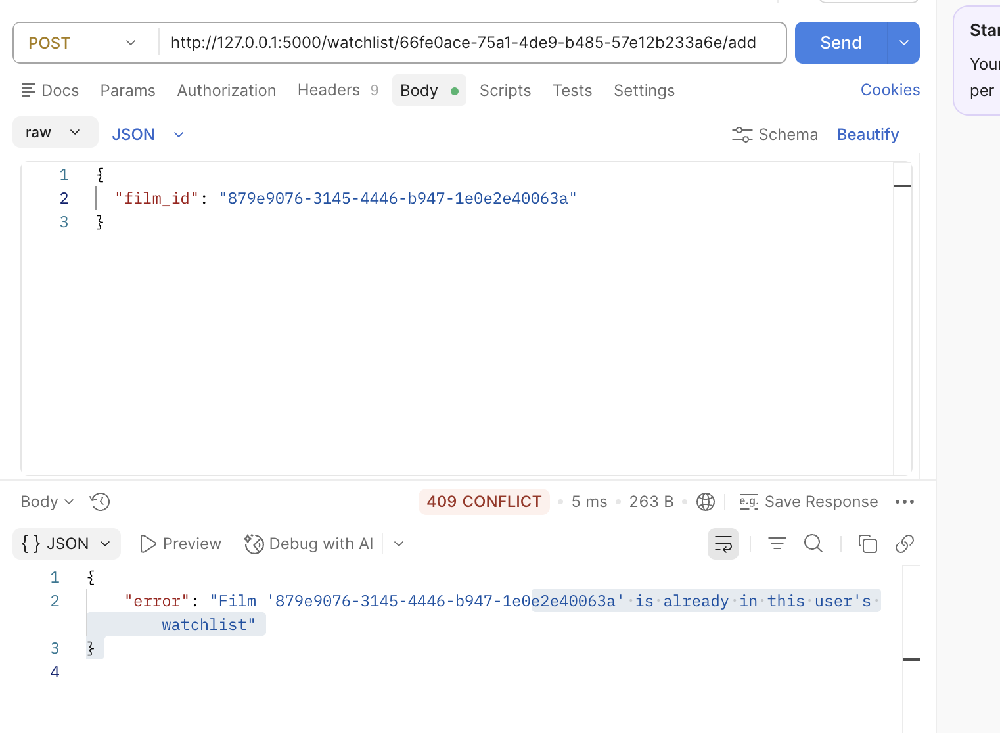
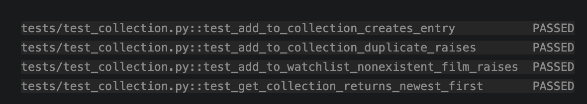
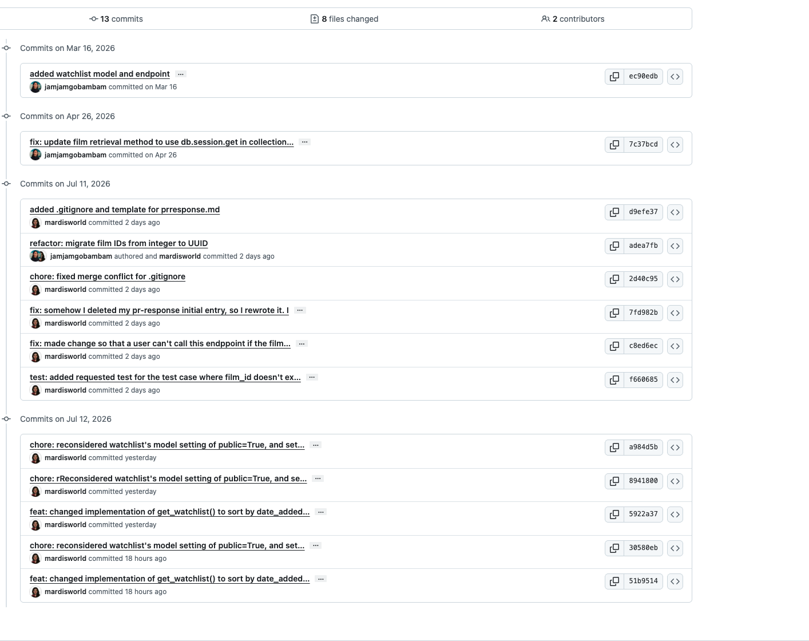
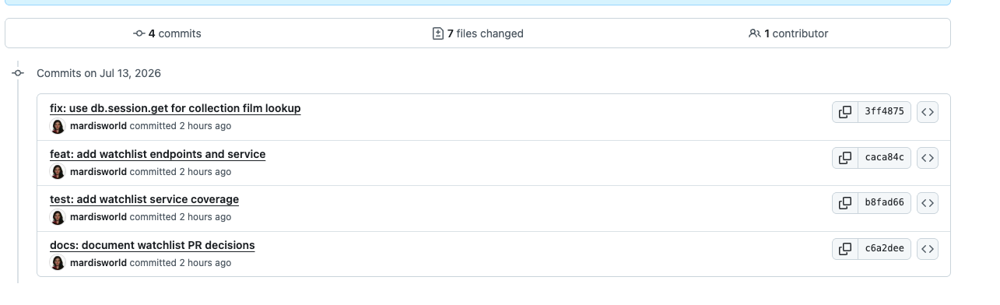

# PR Response Doc — CineLog Watchlist Feature

## AI Usage
1. I asked AI: Can you explain the project structure's flow? Looking at app.py, I don't see it calling watchlist_service.py or collection_service.py. How does the app start?

This is the response I got back from Claude:

Great question — and the answer is that app.py never calls the services directly, and it's not supposed to. This is a classic layered Flask architecture where each layer only talks to the one directly below it. Here's the shape:

The layers

app.py                    ← application factory: wires everything together
  │  registers blueprints
  ▼
routes/*.py               ← HTTP layer: URLs, request parsing, status codes
  │  calls service functions
  ▼
services/*_service.py     ← business logic: rules, validation, dedup
  │  queries/commits via
  ▼
models.py + db            ← data layer: SQLAlchemy models & the database
The services are called by the routes, not by app.py. That's the link you were missing.

How the app actually starts
Entry point — app.py:37–39. Running python app.py hits the if __name__ == "__main__": block, which calls create_app() and then app.run(debug=True). (In tests, create_app(config=...) is called instead — same factory, different config.)

The factory builds the app — create_app():

Creates the Flask app and sets config (DB URL, secret key) — lines 11–19
db.init_app(app) binds the shared SQLAlchemy instance (defined at app.py:7) to this app — line 21
Imports and registers the three blueprints — lines 23–29. This is where the route modules get connected, each under a URL prefix:
films_bp → /films
collection_bp → /collection
watchlist_bp → /watchlist
db.create_all() creates any missing tables — line 32
Blueprints pull in the services — when app.py imports a route module, that module imports its service at the top. For example routes/collection.py:8–14 imports add_to_collection, remove_from_collection, etc. So the service does get loaded — transitively, through the route module, not through app.py.

2. I also encountered errors when running Flask.



AI  helped me to resolve the errors so I could test the endpoints.

3. When I moved to correct the test file, I received this error.



Somehow the changes I had made to change add_to_watchlist() had been reverted to save_to_watchlist(). Claude helped me identify the error and fix them.

4. For the comment that PR reviewer left, I gave Claude the following prompt to receive help to make an informed decision on whether the watchlist model default should be set to true or false.

```
For class, class WatchlistEntry(db.Model):
    """Represents a film a user wants to watch (saved for later)."""
    id = db.Column(db.String(36), primary_key=True, default=generate_uuid)
    user_id = db.Column(db.String(36), db.ForeignKey("user.id"), nullable=False)
    film_id = db.Column(db.Integer, db.ForeignKey("film.id"), nullable=False)
    date_added = db.Column(db.DateTime, default=lambda: datetime.now(timezone.utc))
    public = db.Column(db.Boolean, default=True)

    def to_dict(self):
        return {
            "id": self.id,
            "user_id": self.user_id,
            "film_id": self.film_id,
            "date_added": self.date_added.isoformat(),
            "public": self.public,
        },

PR Reviewer wants to know why watchlists default to public=True. We don't have a documented decision on default visibility for user lists. He wants me to add a note to your PR description explaining my reasoning. He wants to make sure we're being intentional here, not just inheriting a default. If you think about it and think that public should=False, say so but document your decion-making. Just consider the question and decide which option is best, and explain your reasoning.
```

I did not have a good answer, so I asked it to consider the question and provide its reasoning. I agreed with the its reasoning, so I changed the default watchlist model public=False and included its responses, unedited,here in this document.

5. Finally, I had a tremendous amount of trouble with the Git Rebase and cleanup. I didn't really have a choice but to use AI to help me, because the commands that I tried were not working. When I was supposed to clean up the commits, the editor it brought up wouldn't let me type. I had to let Copilot do most of the heavy lifting, with my supervision. 

# Addressing PR Comments

## Comment 1 — Rename

**What I did:**

As suggested by the PR reviewer, I changed the name of save_to_watchlist() to add_to_watchlist(). I also changed the references to this function throughout the repository, so that I could test the endpoints.

**How I verified:**

I submitted a post request with a film id in body and user id in url to add a film_id to user's watchlist.

***

I then verified that it was in user's watchlist:




## Comment 2 — Deduplication
**What I did:**

I added in an AlreadyInWatchlistError in watchlist_service.py, imported it in to watchlist.py, and added a try except block to catch FilmNotFoundError and AlreadyInWatchlistError in same file.

**How I verified:**

I sent a post request to endpoint to add to user's watchlist, then sent again and received this error message back.



## Comment 3 — Missing test
**What I did:**

Added condition to existing text that if FilmNotFoundError was raised, the film was not persisted to database.

**How I verified:**

I ran tests and verified that they are all passing.




## Comment 4 — Default visibility

**My position:**
Watchlist entries should default to public=False (private).

**Reasoning:**

Reasoning: The cost of the two possible wrong defaults is asymmetric — a wrongly-public list leaks personal data irreversibly, while a wrongly-private list costs the user one click to share. Watchlist data is intent data (what someone wants to watch), which can be sensitive. Privacy-by-default is also the regulatory/industry norm (GDPR Art. 25): sharing personal data should be opt-in, not opt-out. public=True reads as an inherited default rather than an intentional choice.

**Tradeoff acknowledged:**

If CineLog is meant to be social/discovery-first, private-by-default adds friction to sharing. I accept this because sharing can be enabled later via explicit opt-in, whereas trust lost from leaking data by default cannot be recovered.

## Comment 5 — Sort order

**My position:**

I agree with the reviewer. I changed `get_watchlist()` to sort by `date_added` descending (most recently added first) instead of alphabetically by title. Previously it used `.order_by(Film.title.asc())`; it now uses `.order_by(WatchlistEntry.date_added.desc())`. I made the following changes to the codebase:

**models.py**
I added a film relationship to WatchlistEntry.
film = db.relationship("Film", backref="watchlist_entries", lazy=True)

**services/watchlist_service.py**

Sort order changed from Film.title.asc() → WatchlistEntry.date_added.desc(), so get_watchlist now returns most recently added first (matching get_collection's behavior). Docstring updated to say so.

**tests/test_collection.py**
I added test_get_watchlist_returns_newest_first, mirroring the collection sort test: two entries with different date_added, asserting the newer one (Blade Runner) comes first.

**Reasoning:**

A watchlist is a running list of "things I just decided I want to watch," so recency matches how people actually use it — the film you added a minute ago is the one you're most likely thinking about, and it should be at the top rather than buried wherever it falls alphabetically. This also makes the watchlist consistent with the collection: `get_collection()` already returns newest-first, so both of a user's lists now behave the same way, which is less surprising. Alphabetical order is really only helpful for *looking something up* in a long list, which is a secondary use case and can be handled later with an explicit sort control if users ask for it.

**Engagement with reviewer's point:**

The reviewer's reasoning — "most users want to see what they added recently" — is exactly right and is the deciding factor here, so I didn't see it differently. The one nuance worth noting for the future is that recency-first is the best *default*, not necessarily the only option: for very long watchlists an alphabetical or filterable view could be a useful opt-in later. But as a default we're aligned, and the decision is now documented and implemented.

**How I verified:**

I updated `test_get_watchlist_returns_newest_first` (mirroring the existing collection sort test): it adds two entries with different `date_added` timestamps and asserts the newer one comes back first. All tests pass.

## Comment 6 — Rebase
**What conflicted:**

One file that had a conflict was .gitignore, prresponse.md, watchlist.py, models.py, test_collection.py,

This was awful. I had already resolved the UUID problem before beginning the rest of the fixes, so this might have caused more errors than if i had not done that, but performing:

git fetch origin and

git rebase origin/main

led to a host of issues. I don't remmeber all of them, and I don't have all of them in my terminal history.

Some of the errors I encountered:

```
(.venv) (base) marissastaller@Marissas-MBP ai201-project6-cinelog-starter % git status
interactive rebase in progress; onto bbe206c
Last commands done (3 commands done):
   pick 7c37bcd fix: update film retrieval method to use db.session.get in collection and watchlist services
   pick d9efe37 added .gitignore and template for prresponse.md
  (see more in file .git/rebase-merge/done)
Next commands to do (7 remaining commands):
   pick 2d40c95 chore: fixed merge conflict for .gitignore
   pick 7fd982b fix: somehow I deleted my pr-response initial entry, so I rewrote it. I also added back in the models section that had gotten accidentally deleted.
  (use "git rebase --edit-todo" to view and edit)
You are currently editing a commit while rebasing branch 'feature/watchlist-v2' on 'bbe206c'.
  (use "git commit --amend" to amend the current commit)
  (use "git rebase --continue" once you are satisfied with your changes)

```

```
nothing to commit, working tree clean
(.venv) (base) marissastaller@Marissas-MBP ai201-project6-cinelog-starter % git checkout feat
ure/watchlist-v2
Warning: you are leaving 3 commits behind, not connected to
any of your branches:

  bde04e0 chore: fixed merge conflict
  c8064e4 fix: update film retrieval method to use db.session.get in collection and watchlist services
  1ac4852 added watchlist model and endpoint fixed a bug more changes

If you want to keep them by creating a new branch, this may be a good time
to do so with:

 git branch <new-branch-name> bde04e0

Switched to branch 'feature/watchlist-v2'
```

```
Last commands done (3 commands done):
   pick 7c37bcd fix: update film retrieval method to use db.session.get in collection and watchlist services
   pick d9efe37 added .gitignore and template for prresponse.md
  (see more in file .git/rebase-merge/done)
Next commands to do (7 remaining commands):
   pick 2d40c95 chore: fixed merge conflict for .gitignore
   pick 7fd982b fix: somehow I deleted my pr-response initial entry, so I rewrote it. I also added back in the models section that had gotten accidentally deleted.
  (use "git rebase --edit-todo" to view and edit)
You are currently editing a commit while rebasing branch 'feature/watchlist-v2' on 'bbe206c'.
  (use "git commit --amend" to amend the current commit)
  (use "git rebase --continue" once you are satisfied with your changes)
  ```

  ```
  You are not currenty on a branch.
  ```

  Some of the commands I tried:

  ```
git log --oneline -n1 # Copy the latest commit hash
git checkout main
git merge <commit-hash>
  ```

```
# Correct way to create and switch to a new branch from current branch
git checkout -b feature/watchlist-v2
git switch feature/watchlist-v2
git fetch origin
git switch -c watchlist-v2 origin/watchlist-v2
```

Created a new branch when it said:

```
 bde04e0 chore: fixed merge conflict
c8064e4 fix: update film retrieval method to use db.session.get in collection and watchlist services
1ac4852 added watchlist model and endpoint fixed a bug more changes

If you want to keep them by creating a new branch, this may be a good time
to do so with:

git branch <new-branch-name> bde04e0

```

My branch never showed up in my GitHub repository.


**How I resolved it:**

Eventually, I gave up and asked Claude and Copilot to resolve my GitHub problmems.

Here are some of the commands it ran for me:

git diff --check

git diff --name-only --diff-filter=U

git status --short

git add pr-response.md && GIT_EDITOR=true git rebase --continue

grep -R "order_by" -n services/watchlist_service.py services/collection_service.py

GIT_EDITOR=true git rebase --continue

git rebase --quit

.venv/bin/python -m pytest tests/test_collection.py

git log --oneline --decorate -5

**How I verified no conflict remains:**

This is what my Git commit history looked like before cleanup.



When I ran the two commands given in the assignment,

```
git log --oneline origin/main..HEAD
git rebase -i HEAD~N
```

I couldn't type into the "editor" at all. So the commit history looks terrible, but I will try to use AI to fix it.

Prompt:

```
I ran these two commands in the terminal: git log --oneline origin/main..HEAD and git rebase -i HEAD~13. This is supposed to help me edit the commits so that they make sense. I am unable to type into the editor. As you can see, I have many duplicates. I need to check that each commit name matches the file changes that are associated with it. These were the rules that were given to me:

Change pick to reword to rename a commit message
Change pick to squash or fixup to combine commits (if you have "fixed stuff" commits to fold in)
Change pick to drop to remove a commit entirely
Leave pick as-is to keep a commit unchanged
IMPORTANT: There should be one commit per fix or feature.

Prefix	When to use
feat:	A new feature or endpoint
fix:	A bug fix
test:	Adding or updating tests
docs:	Documentation changes only
refactor:	Code restructuring with no behavior change
chore:	Maintenance tasks (deps, config, etc.)
Can you help?

```

1. Copilot ran these 4 commands:

git status --short --branch

git log --oneline --decorate origin/main..HEAD

git branch --show-current && git rev-parse --short HEAD && git rev-parse --short origin/main

test -d .git/rebase-merge && find .git/rebase-merge -maxdepth 1 -type f -print | sort || true

And then output:

There’s no active rebase, but pr-response.md has uncommitted edits, so I’m checking that diff before rewriting anything. I’ll preserve those edits in the final documentation commit.

2. Copilot ran these 4 commands:

git diff -- pr-response.md | sed -n '1,260p'

git diff --stat origin/main..HEAD

git diff --stat origin/main

git diff --name-only origin/main

And output:

The branch has 13 commits over origin/main, and the final state touches 7 files. I’m going to inspect the actual final diffs per area now so the rewritten commits follow the repo rule: one logical code fix, feature, test, or docs change per commit.

3. Copilot ran these 2 commands:

git diff origin/main -- app.py routes/watchlist/watchlist.py services/watchlist_service.py models.py | sed -n '1,260p'

git diff origin/main -- services/collection_service.py tests/test_collection.py | sed -n '1,260p'

git diff origin/main -- services/collection_service.py tests/test_collection.py | sed -n '1,260p'


Then output:

The final code breaks into several logical changes, not just three. Based on the project rules, the clean history should separate code fixes/features from tests and docs rather than hiding everything in one large “watchlist” commit.

I’m going to preserve your current uncommitted pr-response.md edits first, then rebuild the branch from origin/main by staging one logical change at a time. I’ll create a backup ref before moving the branch so there’s a recovery point.

4. Copilot ran ran these 2 commands:

git branch backup/feature-watchlist-v2-before-logical-cleanup-20260713 || true

git diff -- pr-response.md > /tmp/cinelog-pr-response-before-cleanup.patch && wc -l /tmp/cinelog-pr-response-before-cleanup.patch

Then output: Backup branch and a patch copy of your documentation edits are in place. Now I’m stashing the uncommitted doc edit, resetting the branch pointer to origin/main while keeping the final branch changes in the working tree, then restoring your doc edit.

5. Copilot ran these 2 commands:

git stash push -m "backup pr-response before logical commit cleanup" -- pr-response.md && git reset --mixed origin/main && git stash pop


Then output:

The stash pop was blocked because pr-response.md is currently an untracked final-branch file after resetting to origin/main; that’s recoverable, and the stash was kept. I’m going to commit the logical code/test changes first, then apply the saved doc patch into the docs commit.


6. Copiot ran the following 2 commands:


git status --short --branch

git diff -- services/collection_service.py

Then output:

The first logical change is clean: it only replaces the deprecated collection lookup with db.session.get. I’m committing that as a fix: commit now.


7. Copilot ran:

git add services/collection_service.py && git commit -m "fix: use db.session.get for collection film lookup"

Then output:

First cleaned commit is done. Next I’m staging the watchlist implementation files only, leaving tests and docs for separate commits per the contribution rules.


8. Copilot ran the following 2 commands:

git diff -- app.py models.py routes/watchlist/watchlist.py services/watchlist_service.py | sed -n '1,260p'

git status --short

Then output:

The implementation commit is app registration plus new watchlist model/route/service. I noticed trailing spaces in the new model blank lines, so I’m cleaning that small formatting issue before committing.

Edited
models.py +2 -2

The model formatting cleanup is in. I’m running a quick diff check, then I’ll commit the feature implementation files only.

9. Copilot ran the following 2 commands:

git diff --check app.py models.py routes/watchlist/watchlist.py services/watchlist_service.py

git status --short

Then output:

Implementation files are clean. I’m committing them as a single feat: commit for the watchlist feature, while keeping tests and documentation separate.

10. Copilot ran the following command:

git add app.py models.py routes/watchlist/watchlist.py services/watchlist_service.py && git commit -m "feat: add watchlist endpoints and service"

Then output:

Feature implementation is committed. The remaining code change is test coverage, so I’m reviewing that diff and then committing it as test:.

11. Copilot ran the following 2 commands:

git diff -- tests/test_collection.py | sed -n '1,220p'

The test file passes and contains only test coverage changes. I’m committing that separately now.

12. Copilot ran the following command:

git add tests/test_collection.py && git commit -m "test: add watchlist service coverage"

Then output:

Tests are now a separate commit. The only remaining change is pr-response.md, and I’m applying your saved documentation cleanup patch before committing it as docs:.

13. Copilot ran the following 2 commands:

git apply --check /tmp/cinelog-pr-response-before-cleanup.patch

git status --short

Then output:

The saved patch applies cleanly. I’m applying it now, then I’ll run the whitespace/conflict check on the documentation before committing.

14. Copilot ran the following command:

git apply /tmp/cinelog-pr-response-before-cleanup.patch && git diff --check -- pr-response.md

Then output:

The documentation cleanup patch is applied and passes git diff --check. I’m reviewing the start/end of the doc once so we don’t commit the accidental duplicated header again.

15. Copilot ran the following command:

git diff --stat -- pr-response.md

The duplicate header is gone and the doc starts correctly. I’m reading the tail of the rebase section once more because the file continues past the first range.

The docs now include your rebase notes and no duplicate top block. I’m committing this as the documentation-only commit.

16. Copilot ran the following 4 commands:

git log --oneline --decorate origin/main..HEAD

git status --short --branch

.venv/bin/python -m pytest tests/test_collection.py

git diff --check origin/main..HEAD

Then output:

Validation passed: four commits, clean working tree, and tests pass. The branch now diverges from the pushed remote because the remote still has the old 13-commit history; that is expected after rewriting local history. I’m checking the exact local-vs-remote diff before any force push.

17. Copilot ran the following 3 commands:

git diff --stat origin/feature/watchlist-v2..HEAD

git diff origin/feature/watchlist-v2..HEAD -- models.py | sed -n '1,120p'

git diff origin/feature/watchlist-v2..HEAD -- pr-response.md | sed -n '1,220p'

Then output:

The cleaned commits now match the rules: fix: touches one service fix, feat: touches the watchlist implementation, test: touches only tests, and docs: touches only the PR response. To make GitHub show this cleaned history, the branch must be force-pushed with lease because the old remote history has to be replaced.

18. Copilot asked: Q: Push the cleaned 4-commit history to origin/feature/watchlist-v2 with --force-with-lease?
A: Yes, force-push with lease - Replace the messy remote commit history with the cleaned local history.

Then output:

I’ll force-push with lease now, which only updates the remote if it still points where we last fetched. After that I’ll verify GitHub’s tracking branch and clean up the temporary stash if it’s no longer needed.

19. Copilot ran the following 5 commands:

git push --force-with-lease origin feature/watchlist-v2

git fetch origin && git status --short --branch

git log --oneline --decorate origin/main..origin/feature/watchlist-v2

.venv/bin/python -m pytest tests/test_collection.py

git diff --check origin/main..HEAD

Then output:

The remote now shows the cleaned four-commit history and tests pass. I’m dropping the temporary stash that only held the already-committed PR response edit; I’ll leave the backup branch in place as a safety checkpoint.

20. Copilot ran the following command:

git stash drop stash@{0} && rm -f /tmp/cinelog-pr-response-before-cleanup.patch && git stash list --format='%gd %s' && git status --short --branch

Then output:

Done. I cleaned the branch history and pushed it to origin/feature/watchlist-v2 with --force-with-lease.

The remote now has 4 logical commits, each matching the commit prefix rules:

c6a2dee docs: document watchlist PR decisions
b8fad66 test: add watchlist service coverage
caca84c feat: add watchlist endpoints and service
3ff4875 fix: use db.session.get for collection film lookup

I also preserved your latest pr-response.md edits, removed the accidental duplicated header block, and dropped the temporary stash after confirming everything was committed.

Validation passed:

git status --short --branch: synced with origin/feature/watchlist-v2
.venv/bin/python -m pytest tests/test_collection.py: 5 passed
git diff --check origin/main..HEAD: clean
I left a local backup branch in case you need the old history: backup/feature-watchlist-v2-before-logical-cleanup-20260713.

Commit History After Cleanup:




## PR Description

This PR adds the watchlist feature to CineLog. Users can now save films they want to watch later, view their saved watchlist, and receive clear errors if they try to add a film that does not exist or a film that is already on their watchlist. I also cleaned up the watchlist service naming so it matches the existing collection service pattern: `add_to_watchlist()` now mirrors `add_to_collection()`.

I made two intentional behavior decisions while working on this feature. First, watchlist entries now default to `public=False` because a watchlist can reveal personal intent, and it is safer to make sharing opt-in instead of exposing user data by default. Second, `get_watchlist()` now returns films by `date_added` descending, so the most recently saved films appear first. That matches how `get_collection()` already behaves and feels more useful for a list of things someone just decided they want to watch.

I manually tested the watchlist flow by sending a POST request to add a film to a user's watchlist, then confirming that the film appeared when viewing that user's watchlist. I also tested the duplicate case by sending the same add request again and confirming that the API returned the expected already-in-watchlist error. For automated coverage, I added tests for the nonexistent-film case and for newest-first watchlist sorting, then verified the test file passes with `.venv/bin/python -m pytest tests/test_collection.py`.

## Stretch Feature remove_from_watchlist()

I added `remove_from_watchlist(user_id, film_id)` as a stretch feature in `watchlist_service.py`. The function looks up a user's watchlist entry for the given film, removes it from the database if it exists, commits the change, and returns `True` so callers can tell the removal succeeded. If the film is not in that user's watchlist, it raises `NotInWatchlistError`, matching the pattern used by `remove_from_collection()`.

I also added a `DELETE /watchlist/<user_id>/remove` endpoint in `routes/watchlist/watchlist.py`. It accepts a JSON body with `film_id`, calls `remove_from_watchlist()`, returns a success message when the entry is removed, and returns a 404 error if the film is not in that user's watchlist.

I also wrote `test_remove_from_watchlist_deletes_entry` in `tests/test_collection.py`. The test adds a film to a user's watchlist, calls `remove_from_watchlist()`, and verifies that the matching `WatchlistEntry` is no longer persisted in the database. I verified that all tests pass. 

## Stretch Feature: Added Unit Tests

I added 9 more unit tests, based on Copilot's analysis of what would be most useful. 

The main missing edge cases are around the watchlist-specific behavior and the route layer.

Most useful tests to add next:

1. add_to_watchlist happy path
You test add_to_collection creates an entry, but not add_to_watchlist. Add a test that calls add_to_watchlist() with a real film and asserts a WatchlistEntry exists.

2. add_to_watchlist duplicate case
The service has AlreadyInWatchlistError, but there is no test proving it raises when the same user adds the same film twice or that only one row remains.

3. remove_from_watchlist missing entry case
You added the success case, but not the failure path. Add a test that calls remove_from_watchlist() for a film that is not on the watchlist and expects NotInWatchlistError.

4. Route test for missing film_id on add
POST /watchlist/<user_id>/add returns 400 if the body is missing film_id, but there is no test for that HTTP behavior.

5. Route test for duplicate add
The route catches AlreadyInWatchlistError and returns 409, but that status code is not tested.

6. Route test for remove success
DELETE /watchlist/<user_id>/remove should return 200 and remove the row. Right now only the service function is tested.

7. Route test for remove missing entry
DELETE /watchlist/<user_id>/remove should return 404 when the film is not in that user’s watchlist.

8. Empty watchlist case
get_watchlist(user_id) should return an empty list for a user with no watchlist entries.

9. User isolation
If user A has a film on their watchlist, user B’s watchlist should not include it. This is a good guard against accidentally querying by film_id only. get_watchlist() should not leak another user's watchlist entries.